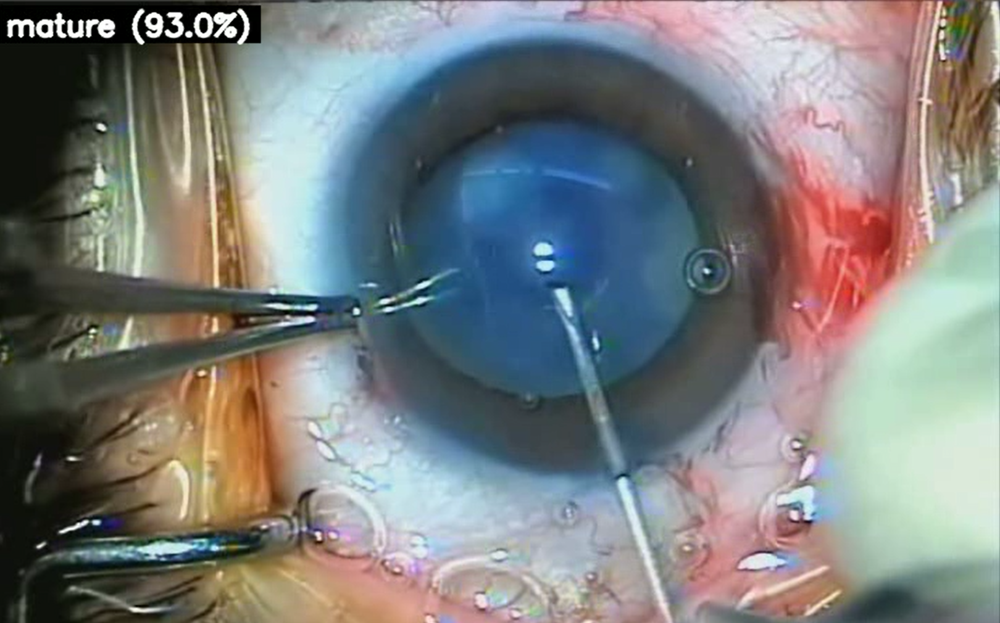

# Cataract Surgery Difficulty Classification

  

This repository presents a deep learning framework for automated assessment of cataract surgery difficulty from surgical microscope images. The project focuses on classifying the eye’s nuclear density — a key factor in surgical complexity — into five difficulty levels.  

---

## Problem Overview
Cataract surgery is one of the most frequently performed surgical procedures worldwide. The difficulty of the operation is strongly influenced by the nuclear density of the cataract, which can impact surgical time, complication risk, and required instrumentation. Manual grading is subjective and varies between surgeons, motivating the development of automated systems.

---

## Dataset
A custom dataset of **4,000 surgical microscope frames** was curated, evenly distributed across five difficulty classes:

1. **Low nuclear density** – red reflex fully visible  
2. **Moderate nuclear density** – partial red reflex visible  
3. **High nuclear density** – red reflex not visible  
4. **Mature cataract** – cortex layer appears milky white, nuclear structure obscured  
5. **Poor dilation** – constricted iris, sometimes with mechanical retractors  

Images were sampled directly from the operating microscope during the cataract surgery workflow.  
Due to clinical restrictions, the dataset cannot be released publicly.  

---

## Methods
We explored both convolutional and transformer-based architectures using transfer learning:

- **CNN-based models:**  
  ResNet-18, ResNet-50, EfficientNet-B0 to B5, DenseNet-121/169, VGG-16/19  

- **Transformer-based models:**  
  Swin Transformer, DeiT, ConvNeXt  

Each model was trained and evaluated under identical preprocessing and augmentation protocols, and benchmarked for both classification performance and computational efficiency (GPU/CPU memory usage, inference time).  

---

## Inference Pipeline
To enable video-level classification during surgery:

1. **Phase Detection**: A pre-existing module (developed by collaborators) detects the onset of the **Capsulorhexis phase** in surgical videos.  
2. **Frame Classification**: From this point, each subsequent frame over a **10-second interval** is classified using the trained model.  
3. **Majority Voting**: The most frequent predicted class across the window is assigned as the difficulty level of the case.  

This design ensures robustness against frame-level noise and provides a clinically meaningful prediction per surgical video.  

---

## Results
*(To be updated once benchmark results are finalized.)*  
The best-performing model was selected based on accuracy, F1-score, and computational efficiency during inference.  

---

## Repository Structure
